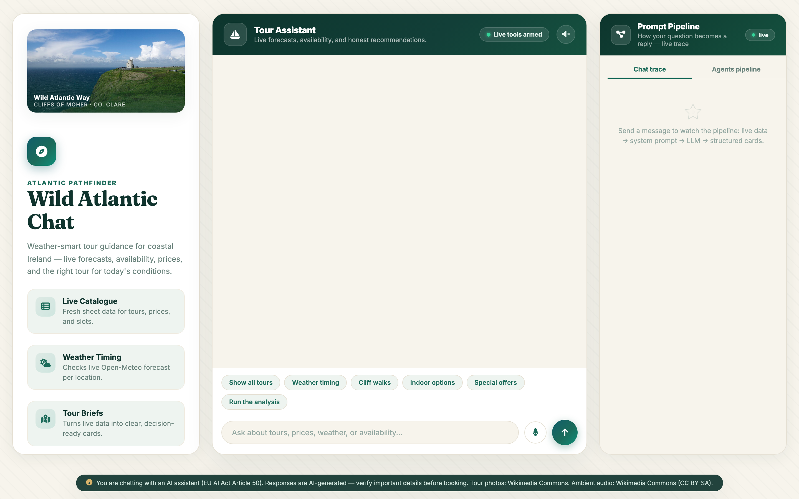
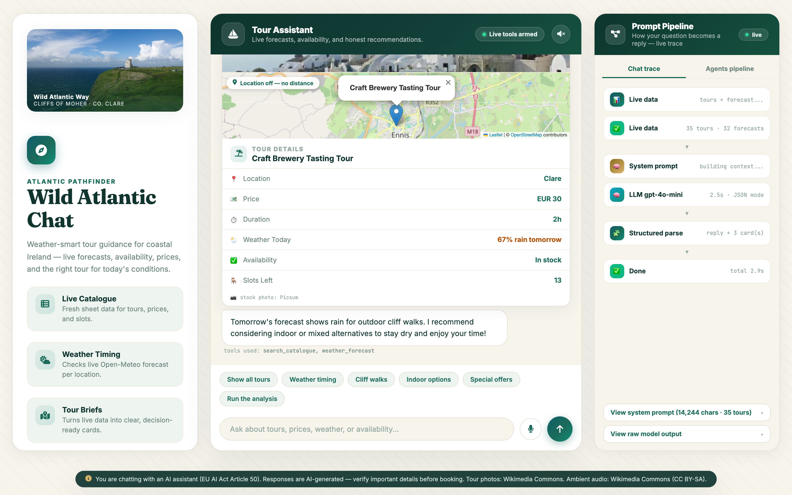
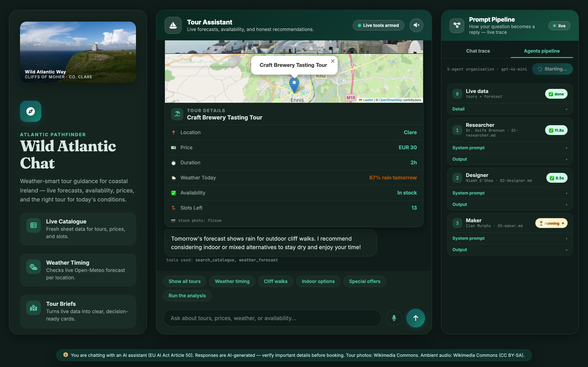
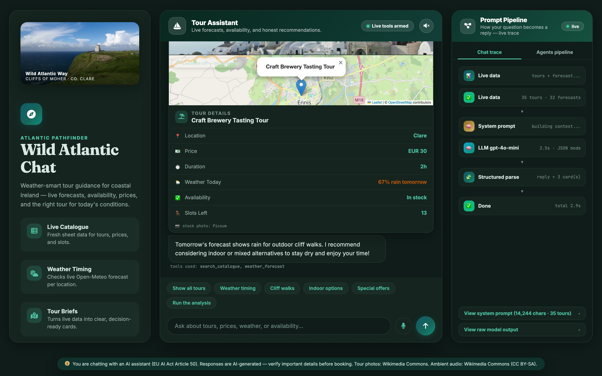

# 🌊 Atlantic Way Tours — Wild Atlantic Chat

A weather-smart, AI-powered tour recommender for Ireland's Wild Atlantic Way. Ask about tours, prices, availability, and today's weather — the assistant answers with live data and decision-ready tour cards (photos, maps, distance, forecast warnings).

**Live demo:** https://chrisgomes1211.github.io/atlantic-way-tours/
**Backend API:** https://atlantic-way-tours-1.onrender.com

---

## 📸 Screenshots

| Chat dashboard | Chat with tour cards | Agents pipeline |
|---|---|---|
|  |  |  |

| Sound picker | Dark mode |
|---|---|
|  |  |

---

## ✨ Features

### Chat assistant (`/api/chat`)
- Live context built per question: **35-tour catalogue** (Google Sheets CSV) + **7-day forecasts** (Open-Meteo, one call per tour location)
- Structured JSON mode (`response_format: json_object`) — cards render deterministically from `tools` + `tours` payload
- Honest degraded mode: if the weather API is rate-limited, the assistant says "No forecast available" instead of inventing numbers
- Trace panel shows exactly how the reply was built: live data → system prompt → LLM → cards

### Five-agent organisation (`/api/orchestrate`)
A separate pipeline that analyses the whole business on demand — kickoff → Researcher → Designer → Maker → Communicator → Manager:

| # | Agent | Persona | Role |
|---|-------|---------|------|
| 1 | Researcher | Data-driven field analyst | Analyses live data: weather, pricing, availability |
| 2 | Designer | Customer-experience strategist | Recommends tour design, routes, experience upgrades |
| 3 | Maker | Practical operations lead | Scopes logistics: fleet, crew, costs, feasibility |
| 4 | Communicator | Marketing specialist | Crafts offers, campaigns, positioning |
| 5 | Manager | Decision-maker | Synthesises everything into a final action plan |

- Runs asynchronously with live progress polling (`/api/orchestrate/start` + `/status`); the Agents tab renders per-agent timings, system prompts, and outputs
- Auto-runs on page load and on explicit chat commands ("run the analysis")
- The pipeline also runs from the CLI: `node pipeline/run-pipeline.js`

### UI / UX
- 3-column dashboard (sidebar / chat / trace-agents), fixed one-screen layout on desktop
- Tour cards: **Swiper photo carousels** (Wikimedia Commons + Picsum stock fallback), **Leaflet + OpenStreetMap** with marker, popup, and a dashed line from your location, straight-line distance chip
- **Dark mode**, **voice input** (Web Speech API, en-IE), **spoken replies**, **ambient sound picker** (synthesised ocean waves + tin-whistle music from Wikimedia Commons, CC BY-SA)
- Animations (entrance, Ken Burns hero, wave divider, shimmer on running agents) — all disabled under `prefers-reduced-motion`
- Toasts, tooltips (Tippy), attribution for all third-party media

---

## 🏗️ Architecture

```
Browser (index.html, single file)
  │  fetch(BACKEND_URL)
  ▼
Express API (server/index.js)              Render (free tier)
  ├─ /api/health        warm-up + keep-alive pings (every 6 min)
  ├─ /api/tours         Google Sheets CSV → 35 tours, 10-min cache
  ├─ /api/weather       Open-Meteo batch forecast, 10-min cache
  ├─ /api/chat          OpenAI gpt-4o-mini, JSON mode, live context
  ├─ /api/agents        five agent system prompts (agents/*.md)
  ├─ /api/orchestrate        synchronous pipeline run
  ├─ /api/orchestrate/start  async run → runId
  └─ /api/orchestrate/status pollable run state (in-memory)
```

- **Model:** `gpt-4o-mini` — cheap enough for multi-agent orchestration
- **Latency work:** client reuses its tours/weather when calling `/api/chat` (server skips re-fetch), tours/weather are cached, retries limited, backend kept warm — typical chat reply ~4–5s
- **Weather quota:** Open-Meteo's free tier is per-IP; Render's shared IP can hit the daily limit. Mitigations: browser-side weather fallback, graceful "No forecast available" labels, auto-switch back to server weather when the quota resets

---

## 🚀 Getting started

### 1. Backend

```bash
cd server
npm install
cp .env.example .env      # add your OPENAI_API_KEY
npm start                 # http://localhost:3001
```

Required env: `OPENAI_API_KEY`. Optional: `TOURS_SHEET_URL`, `PORT`.

### 2. Frontend

`index.html` is fully self-contained (no build step). Point `BACKEND_URL` at your local server or the Render deployment, then serve the folder (GitHub Pages, `npx serve`, or just open the file).

### 3. CLI pipeline

```bash
node pipeline/run-pipeline.js   # requires server/.env with OPENAI_API_KEY
```

---

## 📡 API endpoints

| Method | Path | Description |
|--------|------|-------------|
| GET | `/api/health` | Status + model + agents dir |
| GET | `/api/tours` | `{ tours: [...35], source: "live"\|"cache" }` |
| GET | `/api/weather` | `{ locations, source }` forecast data |
| POST | `/api/chat` | `{ messages: [{role, content}], tours?, weather? }` → `{ reply, tools, tours, meta, system }` |
| GET | `/api/agents` | Five agent personas with system prompts |
| POST | `/api/orchestrate` | Run the full pipeline, await the log |
| POST | `/api/orchestrate/start` | Start async run → `{ runId }` |
| GET | `/api/orchestrate/status?runId=` | `{ status, steps[], agents[], kickoff }` |

---

## 🛠️ Tech stack

OpenAI API · Express · Google Sheets (CSV export) · Open-Meteo · Leaflet + OpenStreetMap · Swiper 11 · Tippy.js · Toastify · Animate.css · Font Awesome · Web Speech API · Web Audio API · Fraunces/Inter/JetBrains Mono

## 🙏 Credits & license

- Tour photos & ambient audio: **Wikimedia Commons** (images — various licences; audio — CC BY-SA 4.0)
- Stock photo fallback: **Picsum Photos**
- Map tiles: **OpenStreetMap** contributors
- This is a **college project** — not a commercial service. Responses are AI-generated; verify important details before booking (EU AI Act Article 50).